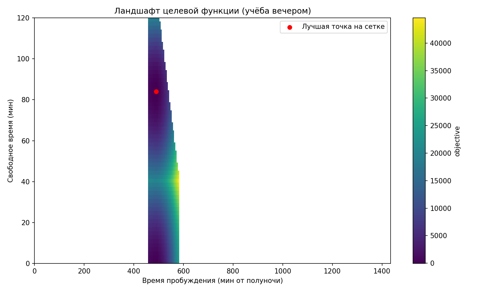
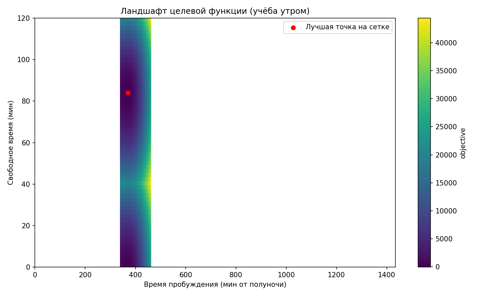
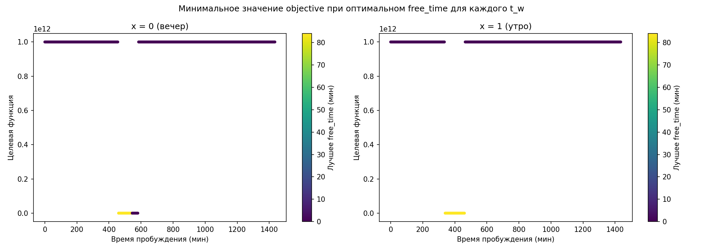
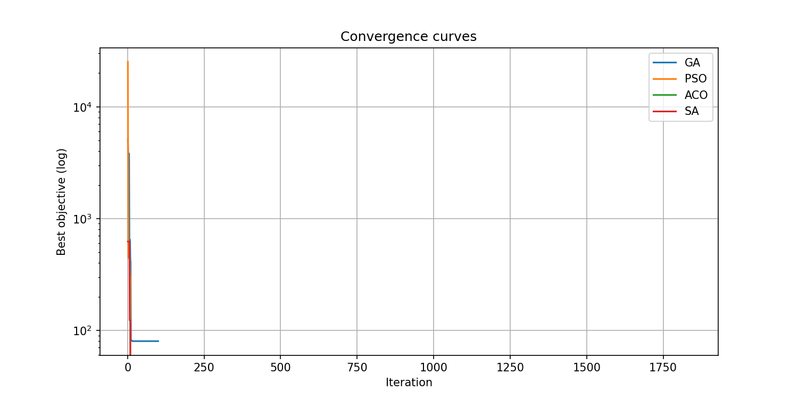

# Идеальный рабочий день

Оптимизация расписания буднего дня по четырём критериям комфорта с помощью четырёх метаэвристических алгоритмов.

## 1. Постановка задачи

### 1.1. Что дано
Фиксированные длительности обязательных блоков дня (в минутах):

| Блок | Обозначение | По умолчанию |
|------|--------------|--------------|
| Утренние сборы | M | 60 |
| Дорога на работу | C | 20 |
| Обед | L | 60 |
| Чистое рабочее время | W_work | 480 |
| Учёба | W_study | 120 |
| Дорога домой | D_back | 30 |
| Вечерний отдых | E | 45 |

### 1.2. Управляющие переменные
Оптимизатор выбирает три величины:

- **t_w** – время пробуждения (целое, 0…1439 минут от полуночи);
- **x** – режим учёбы: 0 – вечером, 1 – утром;
- **free_time** – свободное время перед сном (целое, 0…max_free_time, по умолчанию max_free_time = 120).

Остальные временны́е метки рассчитываются автоматически по формулам из `problem/schedule_builder.py`.

### 1.3. Ограничения (жёсткие)
Расписание считается допустимым, если одновременно выполнены:

1. Начало работы в разрешённом интервале:
   `Work_start_early ≤ t_work_start ≤ Work_start_late`.
2. Сон не короче минимальной нормы:
   `T_sleep ≥ T_min_sleep`.
3. Свободное время не превышает `max_free_time` и неотрицательно.
4. Время отхода ко сну не выходит за текущие сутки.

При нарушении любого ограничения целевая функция получает штраф `1e12`.

### 1.4. Целевая функция
Для допустимого расписания минимизируется сумма штрафов и вознаграждений:

\[
\Phi = w_{phase} P_{phase} + P_{debt} + P_{work} + P_{study} + P_{free}
\]

#### Фаза сна (штраф)
\[
k = \text{round}\left(\frac{T_{sleep}}{Cycle}\right),
\quad T_{ideal} = k \cdot Cycle,
\quad P_{phase} = (T_{sleep} - T_{ideal})^2
\]

#### Недосып / пересып
- Если `T_sleep < T_best_sleep`:
  \[
  P_{debt} = w_{debt} \cdot (T_{best\_sleep} - T_{sleep})^2
  \]
- Иначе (вознаграждение за лишний сон):
  \[
  P_{debt} = -reward\_extra\_sleep \cdot (T_{sleep} - T_{best\_sleep})
  \]

#### Отклонение начала работы от идеала (асимметричный штраф)
\[
\delta = t_{work\_start} - Ideal\_start
\]
\[
P_{work} =
\begin{cases}
w_{work\_late} \cdot \delta^2, & \delta \ge 0 \\
w_{work\_early} \cdot (-\delta)^2, & \delta < 0
\end{cases}
\]

#### Эффективность вечерней учёбы
Если `x = 0` и `t_study_start > Study_ineffective_after`:
\[
P_{study} = w_{study} \cdot W_{study} \cdot (1 - Study\_eff\_drop)
\]
Иначе `P_study = 0`.

#### Свободное время (вознаграждение)
\[
P_{free} = -reward\_free\_time \cdot free\_time
\]

Отрицательные значения Φ означают, что вознаграждения перевесили штрафы.

## 2. Параметры задачи (конфигурация)

Все параметры хранятся в `config.py` в классе `ScheduleProblemConfig`. Значения по умолчанию приведены ниже; их можно изменить перед запуском в `main.py` или прямо в `config.py`.

### Длительности
- M = 60, C = 20, L = 60, W_work = 480, W_study = 120, D_back = 30, E = 45

### Сон
- T_min_sleep = 360 (6 ч)
- T_best_sleep = 540 (9 ч)
- Cycle = 90 (мин)

### Работа
- Work_start_early = 540 (09:00)
- Work_start_late = 660 (11:00)
- Ideal_start = 570 (09:30)

### Учёба
- Study_ineffective_after = 1145 (19:05)
- Study_eff_drop = 0.5

### Веса и вознаграждения
- w_phase = 10
- w_debt = 5, reward_extra_sleep = 2
- w_work_early = 1, w_work_late = 3
- w_study = 3
- reward_free_time = 1

### Параметры алгоритмов
Настройки каждого метода (размер популяции, число итераций и т.д.) лежат в отдельных dataclass’ах: `GAConfig`, `PSOConfig`, `ACOConfig`, `SimAnnealingConfig`.

## 3. Методы оптимизации

| Метод | Файл | Идея |
|-------|------|------|
| Генетический алгоритм (GA) | `methods/genetic.py` | Популяция особей `[t_w, x, free_time]`. Турнирный отбор, элитизм, блендинг-кроссовер, мутация. |
| Рой частиц (PSO) | `methods/pso.py` | Непрерывные частицы. `t_w` и `free_time` – вещественные с округлением, `x` – бинарный по порогу. |
| Муравьиный алгоритм (ACO) | `methods/aco.py` | Дискретизация `t_w` и `free_time` с шагом. Отдельные феромонные матрицы для каждой переменной, вероятностный выбор. |
| Имитация отжига (SA) | `methods/annealing.py` | Случайное возмущение нормальным шумом, иногда переключение режима учёбы, экспоненциальное охлаждение. |

Все методы наследуют `BaseOptimizer` из `methods/base.py`.

### Добавление нового метода
1. Создайте файл в `methods/` (например, `my_method.py`).
2. Определите класс, унаследованный от `BaseOptimizer`:
   ```python
   from methods.base import BaseOptimizer
   class MyOptimizer(BaseOptimizer):
       def optimize(self):
           # решаем задачу, сохраняем историю в self.history
           return (t_w, x, free_time), best_objective
   ```
3. При желании добавьте свой dataclass с параметрами в `config.py` и поле в `ScheduleProblemConfig`.
4. Зарегистрируйте его в `experiments/runner.py` аналогично другим методам.

## 4. Структура проекта

```
project/
├── config.py                 # все параметры задачи и алгоритмов
├── main.py                   # точка входа
├── environment.yml           # зависимости для Conda
│
├── problem/                  # формальная модель задачи
│   ├── objective.py          # целевая функция Φ
│   ├── schedule_builder.py   # построение временных меток
│   ├── constraints.py        # проверка допустимости
│   └── model.py              # классы Solution, Schedule
│
├── methods/                  # алгоритмы оптимизации
│   ├── base.py               # абстрактный базовый класс
│   ├── genetic.py            # GA
│   ├── pso.py                # PSO
│   ├── aco.py                # ACO
│   └── annealing.py          # SA
│
├── utils/                    # визуализация и оформление
│   ├── visualization.py      # построение и сохранение графиков
│   └── display_schedule.py   # форматирование расписания
│
├── experiments/
│   └── runner.py             # запуск всех методов и вывод итогов
│
└── output/                   # результаты (создаётся автоматически)
```

## 5. Инструкция по запуску

### Зависимости
Все зависимости указаны в `environment.yml`. Для создания окружения выполните:

```bash
# conda (рекомендуется)
conda env create -f environment.yml
conda activate Optimization_project
```

Если используете pip, установите вручную (`numpy`, `matplotlib`, `plotly`).

### Запуск
```bash
python main.py
```

Программа:
1. Выведет в консоль все параметры задачи.
2. Сохранит визуализации в папку `output/`.
3. Выполнит полный перебор для поиска глобального минимума.
4. Запустит четыре алгоритма оптимизации.
5. Напечатает сводную таблицу и найденные расписания.

## 6. Визуализации (папка `output/`)

### Двумерные тепловые карты

*Целевая функция при учёбе вечером (x=0). Ось X – время пробуждения, Y – свободное время. Цвет – значение Φ.*


*То же для учёбы утром (x=1).*

### Оптимальный срез

*Для каждого t_w подобрано лучшее free_time. Цвет точек – выбранное свободное время.*

### Трёхмерные поверхности (интерактивные HTML)
- [Поверхность для вечерней учёбы](output/3d_surface_x0.html) ([скриншот](output/3d_surface_x0_screen.png))
- [Поверхность для утренней учёбы](output/3d_surface_x1.html) ([скриншот](output/3d_surface_x1_screen.png))
- [Совмещённый график (красный – вечер, синий – утро)](output/3d_both_surfaces.html) ([скриншот](output/3d_both_surfaces_screen.png))

### Сходимость алгоритмов

*Лучшее значение Φ на каждой итерации для каждого метода (логарифмический масштаб).*

## 7. Пример результатов

```
Сводная таблица результатов
Метод/Глоб. мин      t_w    x    Free   Objective    Time, s   
GA, ACO              370    1    85     -85.00       0.023, 0.866
PSO                  490    0    85     -85.00       0.010     
SA                   370    1    0      80.00        0.046     
ГЛОБАЛЬНЫЙ МИНИМУМ   370    1    85     -85.00       —         
```

Расписание, соответствующее глобальному минимуму:
```
Пробуждение в 06:10, учёба утром, свободное время 85 мин
  Сборы:            06:10 – 07:10
  Учёба:            07:10 – 09:10
  Дорога на работу: 09:10 – 09:30
  Работа:           09:30 – 17:30
  Обед:             17:30 – 18:30
  Дорога домой:     18:30 – 19:00
  Отдых:            19:00 – 19:45
  Свободное время:  19:45 – 21:10 (85 мин)
  Сон:              21:10 – 06:10 (540 мин)
```

## 8. Расширение

- Для добавления нового компонента в целевую функцию измените `problem/objective.py`.
- Для добавления ограничения – дополните `problem/constraints.py` и `schedule_builder.py` (если нужны новые переменные).
- Для добавления нового алгоритма см. раздел 3.
